# 多智能体生成治理 Skill


**MAGG（Multi-Agent Generative Governance，多智能体生成治理）** 是一个面向 Codex 的 Skill，用来把复杂 AI 生成任务变成一套**可分工、可验证、可审计、可交接**的治理流程。

它不是“多开几个聊天窗口”。它解决的是：当 AI 很容易自我确认、任务范围很大、结果需要交付给别人、或者你明确要求多线程/多角色独立审查时，如何让生成过程有规则、有证据、有边界。

> 仓库：`multi-agent-generative-governance-skill`  
> 一句话介绍：可审计多智能体生成治理 Codex Skill：独立 session 审查、验证证据、受控写入与 AI 自我改进。

## 什么时候该用 MAGG

适合使用 MAGG 的任务，通常有一个共同点：**单次生成很容易看起来完成了，但实际质量、边界或验证不可靠。**

| 任务情形 | 为什么适合用 MAGG | 推荐强度 |
|---|---|---|
| 优化一个 Skill、SOP、提示词体系或工作流 | 容易只改措辞，不解决触发、边界、验证和真实使用问题 | G2/G3 |
| 复杂代码项目、跨文件重构、架构设计 | 需要红队找风险、裁判控范围、验证区分构建通过和真实可用 | G3 |
| PPT、报告、教材、产品方案、故事设定等多章节产物 | 需要目标校准、结构审查、内容一致性和交付审计 | G2 |
| 用户明确要求“多线程”“多 session”“独立视角”“防信息污染” | 必须用独立 Codex session 记录证据，不能用同一会话角色扮演糊弄 | G3 |
| 长时间任务、无人值守任务、24 小时/多轮迭代 | 需要心跳、handoff、锁、状态记录和接管机制 | R2 |
| 需要比较多个候选版本 | 需要候选产物、评审标准、合并裁判和验证记录 | W2/W3 |

不适合使用 MAGG 的任务：

- 简单问答、翻译一句话、改一个很小的格式问题。
- 用户只想要快速草稿，不需要审查和验证。
- 没有真实风险，却为了“看起来高级”强行开很多角色。
- 不能创建独立 session，却仍然想宣称“真实多线程独立审查”。

## 你应该怎么使用

安装后，在 Codex 里直接点名这个 Skill：

```text
使用 $multi-agent-generative-governance 审查并优化这个 Skill。重点检查触发条件、真实多线程边界、验证完整性和交付说明。
```

如果你要真实多线程，需要明确说出来：

```text
使用 $multi-agent-generative-governance 做一次真实多线程审查。红队、蓝队、裁判、验证必须是独立 session，并记录 session id、短名称、输入范围和输出位置。
```

如果你只是要轻量审查，也可以这样说：

```text
使用 $multi-agent-generative-governance 做一次轻量红队审查，不需要独立 session，只要指出主要风险和最小修复建议。
```

MAGG 每次启动后，理想情况下会先给出这些东西：

- 任务契约：目标、范围、禁止范围、验证方式、最低有效改进。
- 模式选择：G1/G2/G3、W1/W2/W3、R0/R1/R2。
- 角色计划：哪些角色真的需要启用，哪些只是同会话 role pass。
- 验证边界：能验证什么，不能宣称什么。

## 一眼判断：该开什么模式

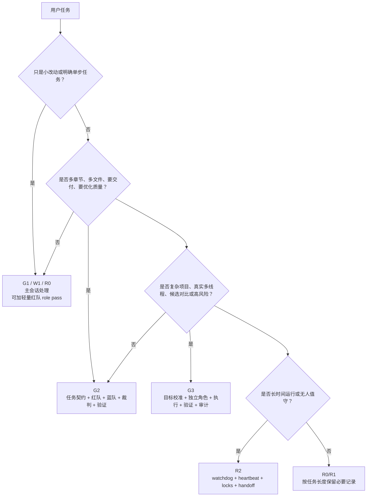

## MAGG 的核心架构

MAGG 把一次复杂生成任务拆成三层：**治理层、执行层、证据层**。

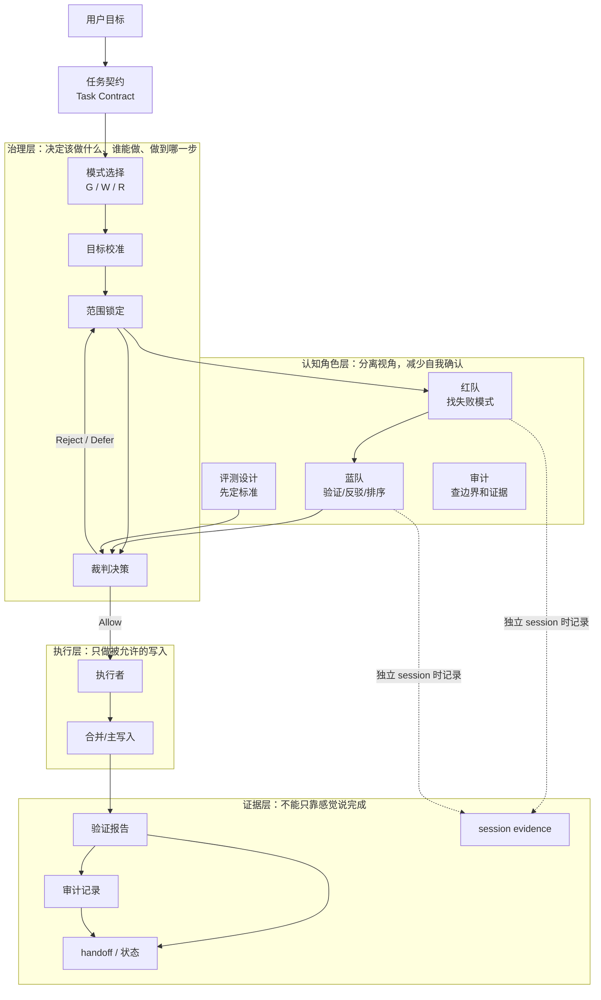

## 标准治理闭环

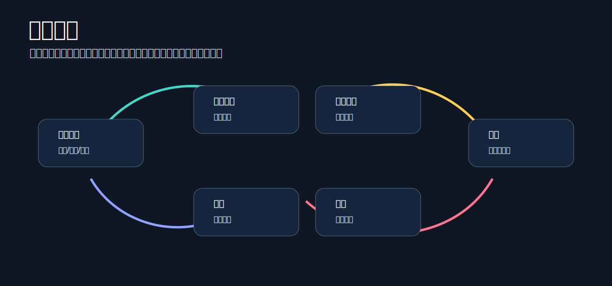

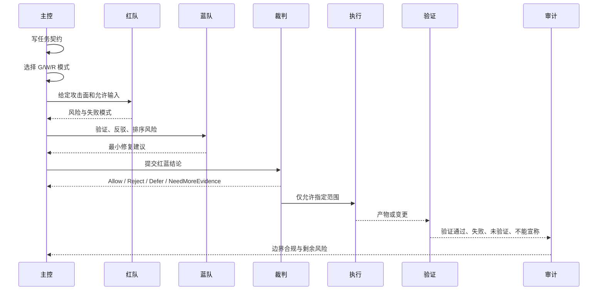

## 真实多线程：不是同一个会话里扮演角色

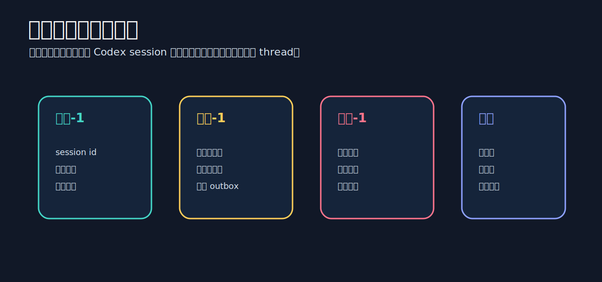

MAGG 的一条硬规则：

> 只有拥有独立 Codex session 的角色，才能叫 thread。  
> 同一会话内的红队/蓝队/裁判只能叫 role pass。

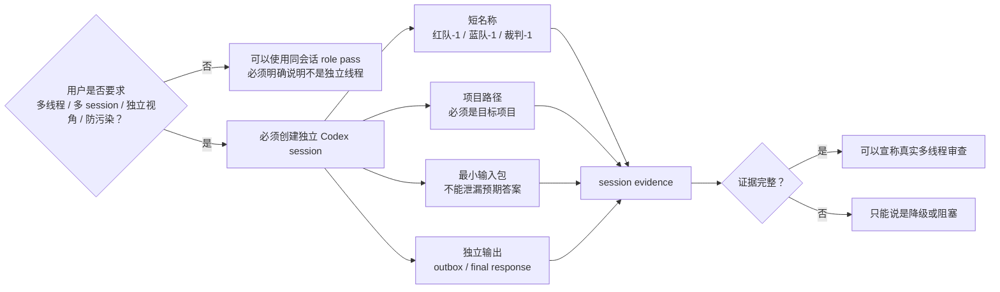

session evidence 至少要记录：

| 字段 | 说明 |
|---|---|
| Role | 红队、蓝队、裁判、验证、审计等 |
| Short title | 用户语言中的短名称，例如 `红队-1` |
| Session/thread id | 独立会话 id |
| Project path | 是否在正确项目下运行 |
| Input summary | 给了什么输入 |
| Forbidden inputs | 明确没有给什么，例如预期答案、其他角色结论 |
| Output pointer | 输出文件或回复位置 |
| Status | pending / active / done / excluded |

## 写入权限模型

MAGG 不允许后台角色随便改最终文件。写入默认由主控或被批准的执行者完成。

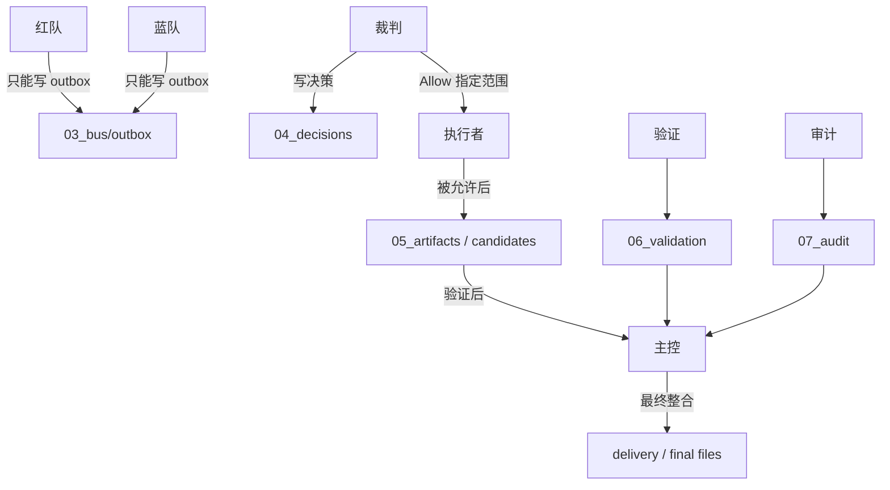

常见规则：

- 红队只找风险，不修复、不批准。
- 蓝队验证和排序，不直接改最终产物。
- 裁判决定允许范围和禁止范围。
- 执行者只做裁判允许的修改。
- 验证报告必须写清楚不能宣称什么。
- 审计检查有没有越界、有没有证据缺口。

## 验证分层：不要把 L0 当 L3

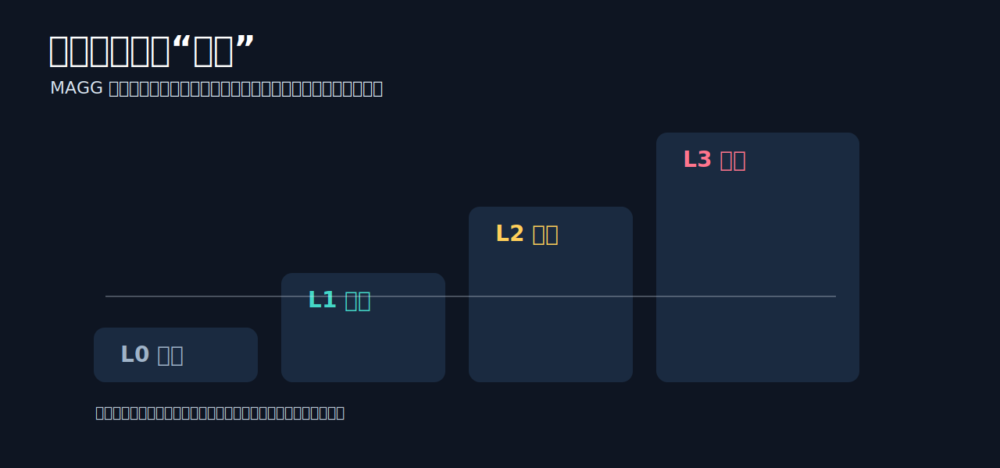

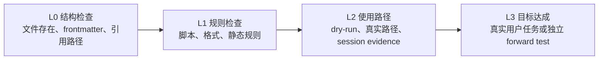

| 等级 | 能证明什么 | 不能证明什么 |
|---|---|---|
| L0 | 文件结构、引用、元数据存在 | 不能证明 Skill 好用 |
| L1 | 校验脚本或规则通过 | 不能证明真实任务成功 |
| L2 | 至少跑过一次真实路径或 dry-run | 不能证明长期稳定 |
| L3 | 对真实目标或独立测试有效 | 仍需记录边界和样本限制 |

每份验证报告都应该分开写：

- 已验证
- 失败项
- 未验证
- 环境缺口
- 不能宣称

## Run Workspace 长什么样

复杂任务会生成或建议一个 run workspace，用来保存任务契约、角色输出、决策、验证和审计。

```text
run_xxxx/
├── 00_manifest/
├── 01_task/
│   ├── task_contract.md
│   └── triage.md
├── 02_state/
│   └── session_evidence.md
├── 03_bus/
│   └── outbox/
│       ├── red_1.md
│       ├── blue_1.md
│       └── judge_1.md
├── 04_decisions/
│   └── judge_decision.md
├── 05_artifacts/
├── 06_validation/
│   └── validation_report.md
├── 07_audit/
│   └── audit.md
├── 08_locks/
├── 09_handoff/
└── delivery/
```

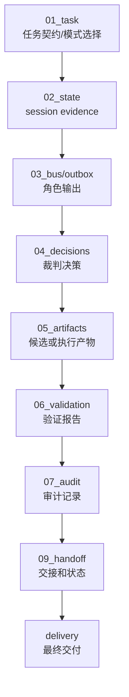

## 典型使用案例

### 1. 优化一个 Skill

```text
使用 $multi-agent-generative-governance 优化这个 Skill。
重点检查：触发描述、真实多线程边界、验证完整性、示例覆盖、安装同步。
先给任务契约和评测标准，再允许修改。
```

预期行为：

- 先定义“什么算真实改进”。
- 先设计 eval，而不是直接改文字。
- 红队找未来误用风险。
- 蓝队过滤偏好型意见。
- 裁判只允许具体文件和章节修改。
- 验证区分 L0/L1/L2/L3。

### 2. 真实多线程审查

```text
使用 $multi-agent-generative-governance 做真实多线程审查。
红队、蓝队、裁判、验证必须是独立 session。
不要让它们看到彼此结论，最后记录 session evidence。
```

预期行为：

- 创建或要求创建独立 session。
- 每个 session 使用短名称。
- 每个 session 只收到本角色需要的输入。
- 没有 session evidence 就不能宣称独立多线程。

### 3. 多候选方案比较

```text
使用 $multi-agent-generative-governance 为这个产品方案生成两个候选版本，再用裁判选择合并方向。
要求保留每个候选的优缺点、验证结果和合并理由。
```

预期行为：

- 进入 W2 或 W3 写入模式。
- 候选写入独立目录或分支。
- 合并前需要验证和裁判决策。
- 最终说明为什么选这个版本。

## 安装

把 Skill 文件夹复制到本机 Codex skills 目录：

```powershell
Copy-Item -Recurse .\multi-agent-generative-governance "$env:USERPROFILE\.codex\skills\multi-agent-generative-governance"
```

仓库结构：

```text
multi-agent-generative-governance-skill/
├── multi-agent-generative-governance/
│   ├── SKILL.md
│   ├── agents/openai.yaml
│   └── references/
│       ├── process-standard.md
│       ├── templates.md
│       └── example-runs.md
├── assets/
│   ├── hero-zh.svg
│   ├── governance-loop-zh.svg
│   ├── session-evidence-zh.svg
│   ├── validation-ladder-zh.svg
│   └── *-en.svg
└── docs/
    ├── MAGG_visual_deck.pdf
    └── MAGG_visual_deck.pptx
```

## 视觉版材料

仓库包含一份更适合展示的视觉介绍材料：

- [`docs/MAGG_visual_deck.pdf`](docs/MAGG_visual_deck.pdf)
- [`docs/MAGG_visual_deck.pptx`](docs/MAGG_visual_deck.pptx)

这份材料的结构是：前半中文，后半英文。图片也分成中文图和英文图，不在同一张图里混排。

---

## English Version


**Multi-Agent Generative Governance (MAGG)** is a Codex Skill for turning complex AI generation into an auditable governance process with role separation, controlled writes, validation evidence, and handoff.

### When To Use MAGG

Use MAGG when a task is too broad, risky, or easy to self-confirm for a single-pass generation:

- Skill, SOP, prompt-system, or workflow optimization.
- Complex code projects or multi-file architecture work.
- Multi-section decks, reports, courseware, product plans, or story systems.
- True multi-thread or independent-session review.
- Long-running work that needs heartbeat, locks, status, and handoff.
- Candidate comparison and merge decisions.

Do not use MAGG for trivial edits, one-line Q&A, or work where the user only wants a fast draft.

### How To Use

```text
Use $multi-agent-generative-governance to review and improve this project plan.
Focus on scope, risks, write control, validation evidence, and what cannot be claimed.
```

For true independent review:

```text
Use $multi-agent-generative-governance for true multi-session review.
Red, Blue, Judge, and Validator must be separate sessions and must record session evidence.
```

### Architecture

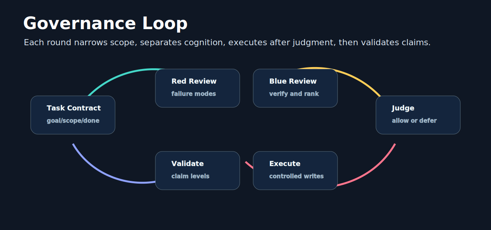

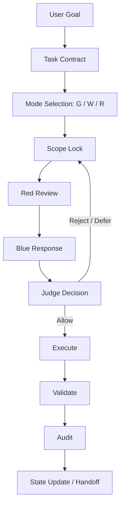

### True Threads

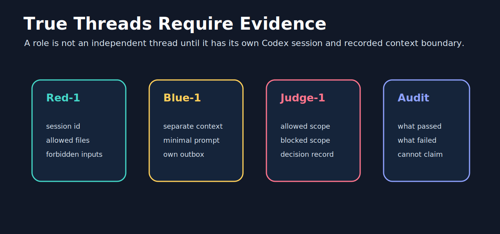

A same-session role pass is useful, but it is not independent. A real thread requires an independent Codex session and recorded session evidence.

### Validation

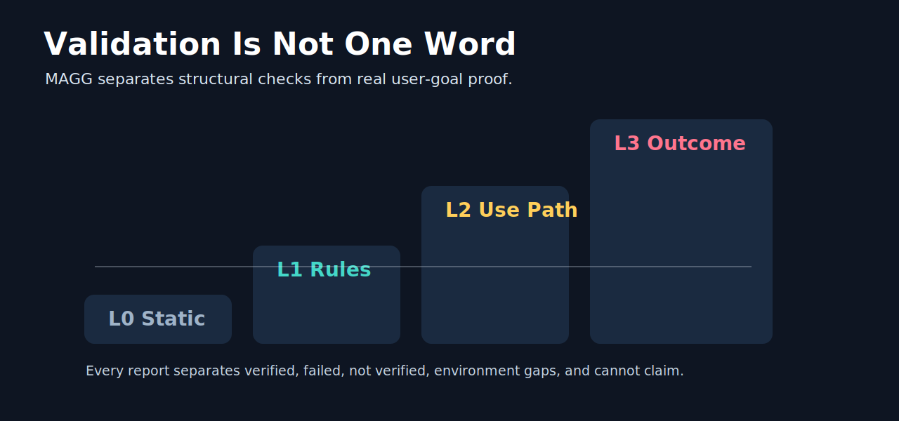

MAGG separates L0 static checks, L1 rule checks, L2 use-path checks, and L3 outcome proof. A validation report should always state what passed, what failed, what was not verified, environment gaps, and what cannot be claimed.

## License

MIT. See [`LICENSE`](LICENSE).
