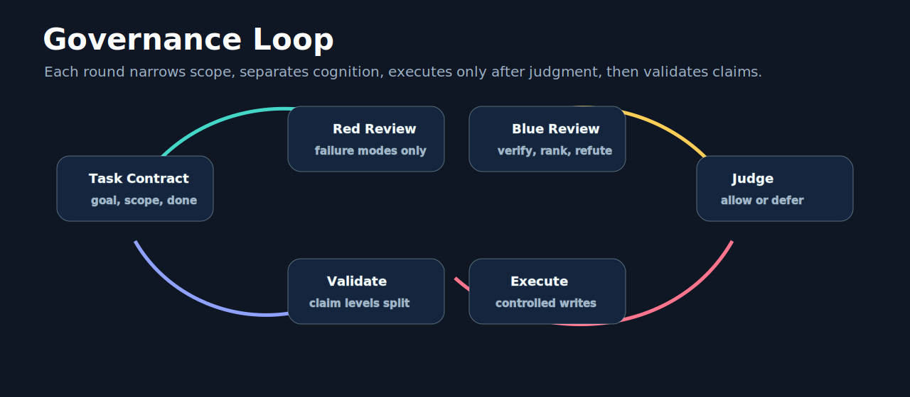
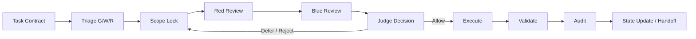
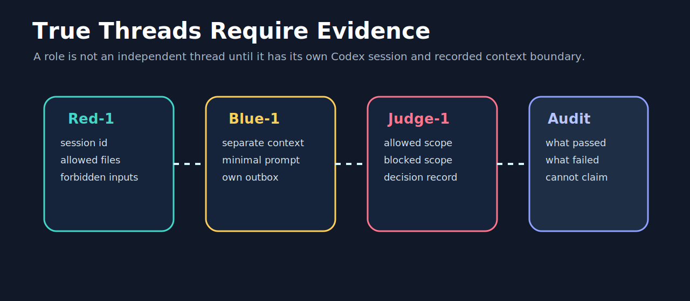
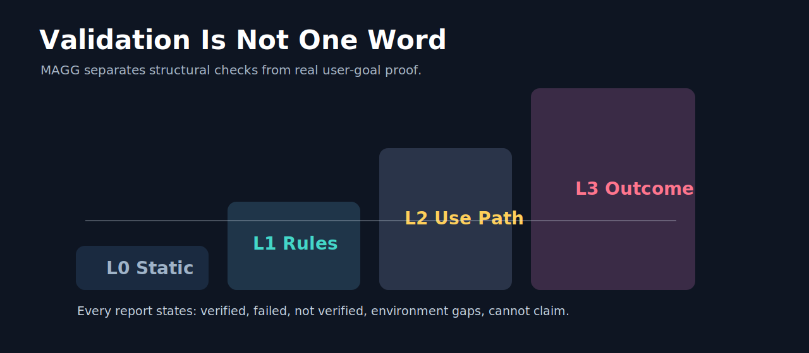
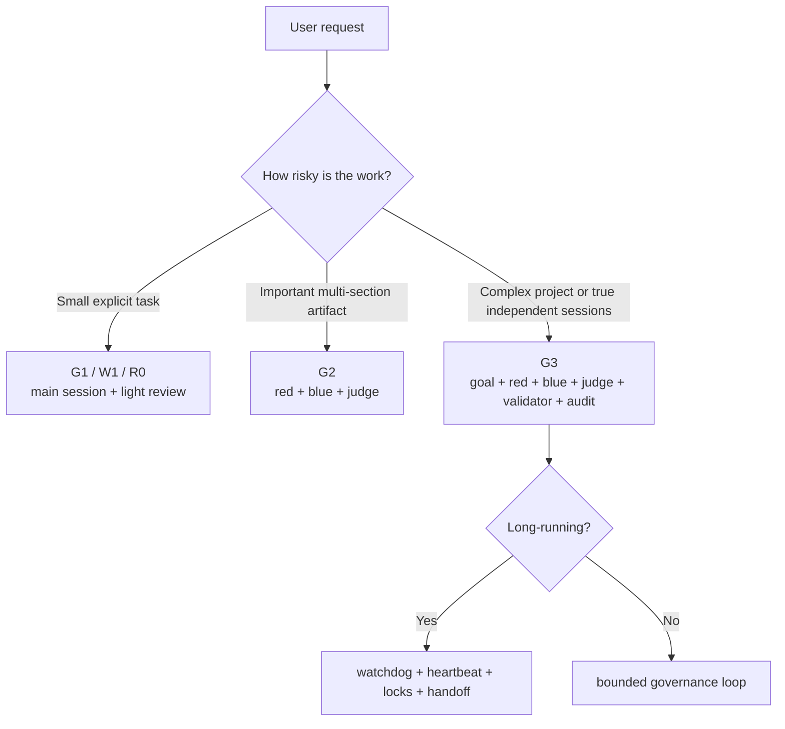

# Multi-Agent Generative Governance Skill



**Multi-Agent Generative Governance**, or **MAGG**, is a Codex Skill for running complex AI generation as an auditable governance process instead of a loose collection of prompts.

It helps Codex design and coordinate red/blue/judge/audit workflows, protect independent-session boundaries, control writes, and separate validation evidence from optimistic claims.

> Repository: `multi-agent-generative-governance-skill`  
> Project description: A Codex Skill for auditable multi-agent generation, independent-session review, validation evidence, and governed AI self-improvement.

## What This Skill Does

MAGG is useful when an AI task is too important, too broad, or too easy to self-confirm. It turns generation into a controlled loop:

- Define the task contract before opening roles.
- Select the smallest governance mode that can actually satisfy the goal.
- Keep true multi-thread work backed by independent Codex sessions.
- Require evidence before claiming independent review.
- Let judges approve edits before execution.
- Validate with explicit levels instead of vague confidence.
- Audit what changed, what failed, and what cannot be claimed.

## Visual Workflow



The loop is deliberately strict: Red finds failure modes, Blue filters and ranks them, Judge decides scope, Executor writes only what is allowed, Validator separates evidence levels, and Audit records remaining risk.



## True Threads, Not Roleplay



MAGG makes a hard distinction:

| Term | Meaning |
|---|---|
| Role pass | Same-session review performed by the main Codex context. Useful, but not independent. |
| Thread | A delegated role backed by a separate Codex session. |
| Session evidence | The record that proves role, title, session id, project path, input scope, forbidden inputs, output, and status. |

When the user asks for **multi-thread**, **multi-session**, **independent perspectives**, or **anti-contamination**, MAGG requires separate project-scoped sessions for enabled roles. If those sessions cannot be created or verified, the workflow must disclose the downgrade instead of pretending.

## Validation Ladder



MAGG avoids turning a cheap check into a big claim:

| Level | What It Proves |
|---|---|
| L0 | Required files and structure exist. |
| L1 | Static rules, validation scripts, or formatting checks pass. |
| L2 | The workflow was dry-run or exercised through a realistic use path. |
| L3 | The result succeeded against the actual user goal or an independent forward test. |

Every validation report should separate:

- Verified
- Failed
- Not verified
- Environment gaps
- Cannot claim

## Repository Layout

```text
multi-agent-generative-governance-skill/
├── multi-agent-generative-governance/
│   ├── SKILL.md
│   ├── agents/openai.yaml
│   └── references/
│       ├── process-standard.md
│       ├── templates.md
│       └── example-runs.md
├── assets/
│   ├── hero.svg
│   ├── governance-loop.svg
│   ├── session-evidence.svg
│   └── validation-ladder.svg
└── docs/
    ├── MAGG_visual_deck.pdf
    └── MAGG_visual_deck.pptx
```

## Quick Start

Install the skill by copying the folder into your Codex skills directory:

```powershell
Copy-Item -Recurse .\multi-agent-generative-governance "$env:USERPROFILE\.codex\skills\multi-agent-generative-governance"
```

Then ask Codex for work that needs governance:

```text
Use $multi-agent-generative-governance to run a red/blue/judge review of this project plan.
```

For Chinese workflows:

```text
使用 $multi-agent-generative-governance 对这个 Skill 做一次真实多线程自省。每个审查线程必须是独立 session，并记录 session id 和短名称。
```

## Example Modes



## Included Visual Deck

The repository includes two image-led deliverables for quick explanation and sharing:

- [`docs/MAGG_visual_deck.pdf`](docs/MAGG_visual_deck.pdf)
- [`docs/MAGG_visual_deck.pptx`](docs/MAGG_visual_deck.pptx)

They are designed as a motion-storyboard style introduction: dark cinematic backgrounds, sweeping process arcs, session cards, and validation frames.

## Design Principles

MAGG is built around five operating principles:

1. **Cognitive separation**: roles have different jobs and should not silently merge.
2. **Controlled writes**: final files are edited only after judge approval.
3. **Evidence before claims**: independent review requires recorded session evidence.
4. **Validation integrity**: L0 checks never masquerade as L3 success.
5. **Bounded iteration**: one closed governance loop beats endless recursive self-review.

## License

MIT. See [`LICENSE`](LICENSE).
