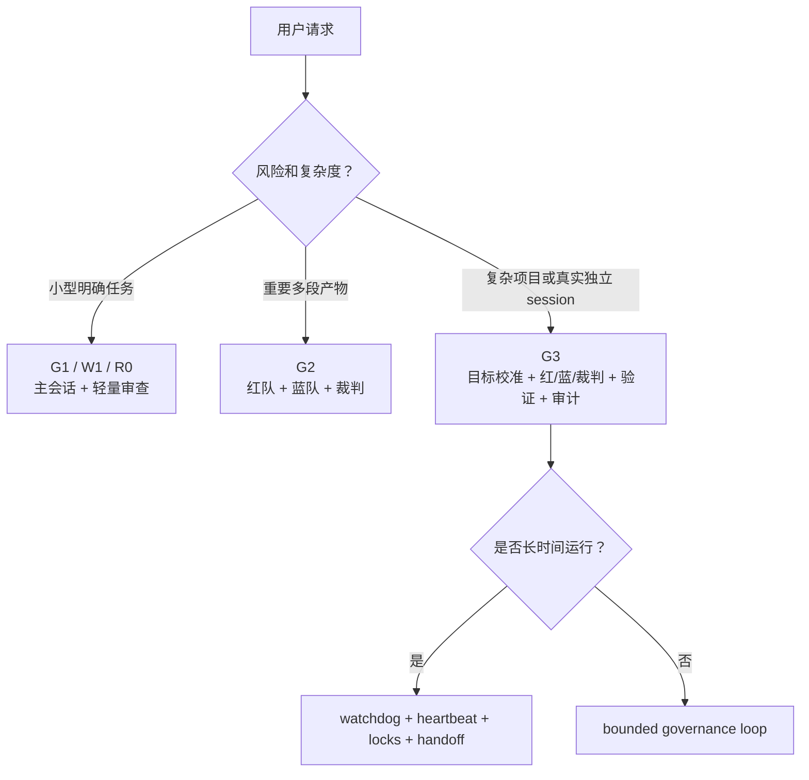
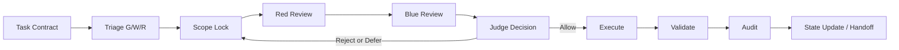

# 多线程生成式治理 Skill


**Multi-Thread Generative Governance（MTGG，多线程生成式治理）** 是一个面向 Codex 的 Skill。它把复杂 AI 生成任务从“多开几个会话碰碰运气”变成一套可审计、可验证、可交接的治理流程。

> 仓库：`multi-thread-generative-governance-skill`  
> 项目介绍：可审计多线程生成式治理 Codex Skill：独立 session 审查、验证证据、受控写入与 AI 自我改进。

## 这个 Skill 解决什么问题

当一个 AI 任务范围大、风险高、容易自我确认，或者需要真实多线程/多 session/多角色审查时，MTGG 会先建立任务契约，再决定是否需要红队、蓝队、裁判、验证、审计等角色。

- 先定义任务契约，再开启角色。
- 真实 multi-thread 必须有独立 Codex session 和 session evidence。
- 裁判允许后才执行写入，避免后台角色直接改最终产物。
- 验证报告必须区分 L0/L1/L2/L3，不能把结构检查伪装成真实效果。

## 可视化流程


MTGG 的核心不是“角色越多越好”，而是让每一轮都清楚回答：目标是什么、攻击面是什么、谁发现风险、谁过滤风险、谁批准修改、验证到了哪一层。


## 真实线程，不是假装独立


在 MTGG 里，同一会话内扮演红队/蓝队/裁判，只能叫 `role pass`；只有拥有独立 Codex session、独立输入包、独立输出记录的角色，才算真正的 `thread`。

| 概念 | 含义 |
|---|---|
| Role pass | 同一 session 内的角色审查，有帮助，但不是独立线程。 |
| Thread | 由独立 Codex session 支撑的委托角色。 |
| Session evidence | 记录角色、短名称、session id、项目路径、输入范围、禁止输入、输出和状态。 |

## 验证分层


MTGG 强制把“文件结构没问题”“规则检查通过”“真实路径跑通”“用户目标达成”拆成不同级别，避免低级验证冒充高级证明。

| 等级 | 能证明什么 |
|---|---|
| L0 | 必要文件、frontmatter、引用结构存在。 |
| L1 | 静态规则、校验脚本或格式检查通过。 |
| L2 | 至少通过真实路径或 dry-run 使用过。 |
| L3 | 已在真实用户目标或独立 forward test 中证明有效。 |

## 仓库结构

```text
multi-thread-generative-governance-skill/
├── multi-thread-generative-governance/
│   ├── SKILL.md
│   ├── agents/openai.yaml
│   └── references/
│       ├── process-standard.md
│       ├── templates.md
│       └── example-runs.md
├── assets/
│   ├── hero-zh.svg
│   ├── governance-loop-zh.svg
│   ├── session-evidence-zh.svg
│   ├── validation-ladder-zh.svg
│   └── *-en.svg
└── docs/
    ├── MTGG_visual_deck.pdf
    └── MTGG_visual_deck.pptx
```

## 快速开始

把 Skill 文件夹复制到本机 Codex skills 目录：

```powershell
Copy-Item -Recurse .\multi-thread-generative-governance "$env:USERPROFILE\.codex\skills\multi-thread-generative-governance"
```

中文示例：

```text
使用 $multi-thread-generative-governance 对这个 Skill 做一次真实多线程自省。每个审查线程必须是独立 session，并记录 session id 和短名称。
```

## 模式示意



## 视觉版材料

仓库包含一份图片感更强的介绍材料，适合快速演示 MTGG 的治理思想：

- [`docs/MTGG_visual_deck.pdf`](docs/MTGG_visual_deck.pdf)
- [`docs/MTGG_visual_deck.pptx`](docs/MTGG_visual_deck.pptx)

## English Version


**Multi-Thread Generative Governance**, or **MTGG**, is a Codex Skill that turns complex AI generation from loose prompting into an auditable, verifiable, and handoff-ready governance process.

> Repository: `multi-thread-generative-governance-skill`  
> Description: A Codex Skill for auditable multi-thread generative governance, independent-session review, validation evidence, controlled writes, and governed AI self-improvement.

### What This Skill Solves

MTGG helps when an AI task is broad, risky, easy to self-confirm, or needs real multi-thread review. It starts with a task contract and activates only the roles the work actually needs.

- Define the task contract before opening roles.
- True multi-thread work requires independent Codex sessions and session evidence.
- Execute writes only after judge approval.
- Validation reports must separate L0/L1/L2/L3 and avoid overstating proof.

### Visual Workflow




### True Threads, Not Roleplay


Same-session red/blue/judge work is a `role pass`. A role becomes a real `thread` only when it has an independent Codex session, scoped input, and recorded output.

### Validation Ladder


MTGG separates structural correctness, rule checks, realistic use-path tests, and real user-goal success so lower-level checks cannot masquerade as higher-level proof.

## License

MIT. See [`LICENSE`](LICENSE).
